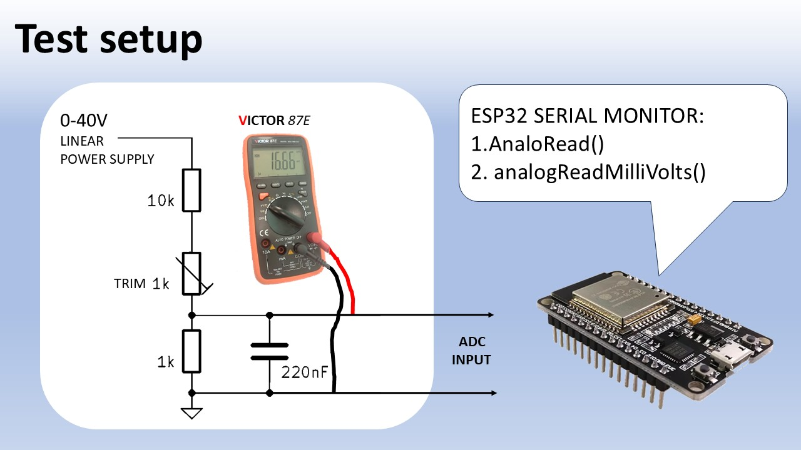

# Description

ESP32 MCU's have a built-in ADC calibration, In the YouTube video how to use it in the Arduino IDE.
It is easy to use; it requires no extra components and no extra code, just replace "analogRead()" with "analogReadMilliVolts()".

# Check out the video:
I will show you how it works and show the accuracy improvement with 2 ESP32 boards:  
1. ESP32 “classic”
2. ESP32 S2 Mini

The tests also reveal that the new ESP32 S & C series perform much better at low ADC voltages compared to ESP32 "Classic".

# Test setup

 

# Files:
ESP32_calibration_demo.ino  
Returns calibrated and non-calibrated ADC results in Serial monitor for comparison

